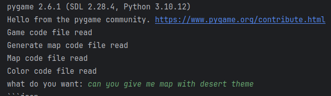
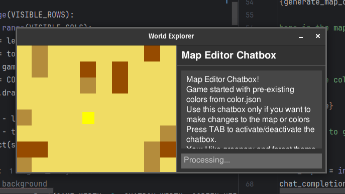
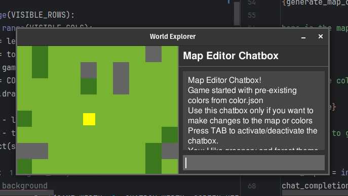

# AI-Powered Map Generator

<h3 align="left">A dynamic, AI-powered map generator built with Pygame</h3>

This project allows users to create and modify game maps through natural language prompts. It demonstrates the integration of AI capabilities into game development workflows, enabling real-time map customization and theme changes.

## Features

  <table>
    <tr>
      <td><strong>🎮 Interactive Map Exploration</strong></td>
      <td>Navigate a procedurally generated tile-based map using keyboard controls</td>
    </tr>
    <tr>
      <td><strong>🤖 AI-Powered Map Customization</strong></td>
      <td>Use natural language to request map theme changes (desert, rainforest, etc.)</td>
    </tr>
    <tr>
      <td><strong>⚡ Real-time Map Modification</strong></td>
      <td>See your requested changes applied instantly to the game world</td>
    </tr>
    <tr>
      <td><strong>🌍 Intelligent Terrain Generation</strong></td>
      <td>Procedurally generated maps with rivers, lakes, and various terrain types</td>
    </tr>
    <tr>
      <td><strong>💬 Chatbox Interface</strong></td>
      <td>Built-in communication system for interacting with the AI</td>
    </tr>
  </table>

## Visual Demonstration

### Starting the Application

This screenshot shows the initial terminal interface when launching the application. The terminal displays the startup process and prompts the user to create a desert-themed map as the starting point.

### Initial Desert Map

This image displays the default desert-themed map generated at startup. The map features various terrain types including light green grass (walkable), dark green bushes (walkable), gray stones (obstacles), and blue rivers (not walkable). The yellow square represents the player character that can be moved using keyboard controls.

### Processing a Request for a Rainforest Map

This screenshot demonstrates the chatbox interface in action. The user has activated the chatbox (by pressing TAB) and entered a request to create a rainforest-themed map. The AI is processing this natural language request and will generate the appropriate changes to the map's terrain and color scheme.

### Final Rainforest-Themed Map

The result of the AI-processed request - a completely transformed map with a rainforest theme. Notice how the color palette has shifted to represent lush vegetation with deeper greens for the grass and bushes, and a more vibrant blue for the water features. This demonstrates the AI's ability to interpret natural language requests and apply contextually appropriate changes to the game environment in real-time.

## Installation

  <table>
    <tr>
      <td align="center"><strong>Step 1</strong></td>
      <td>
        <strong>Clone the repository:</strong> 
        <code>git clone https://github.com/adityasasidhar/fun-with-pygame.git</code> 
        <code>cd fun-with-pygame</code>
      </td>
    </tr>
    <tr>
      <td align="center"><strong>Step 2</strong></td>
      <td>
        <strong>Create a virtual environment (recommended):</strong> 
        <code>python -m venv venv</code> 
        <code>source venv/bin/activate</code> <i>(On Windows: <code>venv\Scripts\activate</code>)</i>
      </td>
    </tr>
    <tr>
      <td align="center"><strong>Step 3</strong></td>
      <td>
        <strong>Install the required dependencies:</strong> 
        <code>pip install -r requirements.txt</code>
      </td>
    </tr>
    <tr>
      <td align="center"><strong>Step 4</strong></td>
      <td>
        <strong>Run the game:</strong> 
        <code>python game.py</code>
      </td>
    </tr>
  </table>

## Usage

  <table>
    <tr>
      <td align="center"><strong>🎮 Navigation</strong></td>
      <td>
        • Use WASD or arrow keys to move the yellow player character around the map 
        • Only grass (light green) and bush (dark green) tiles are walkable
      </td>
    </tr>
    <tr>
      <td align="center"><strong>💬 Interacting with the AI</strong></td>
      <td>
        • Press TAB to activate/deactivate the chatbox 
        • Type your request for map modifications (e.g., "Create a rainforest themed map") 
        • Press ENTER to submit your request 
        • Wait for the AI to process your request and apply the changes
      </td>
    </tr>
    <tr>
      <td align="center"><strong>🗺️ Map Features</strong></td>
      <td>
        • G (Grass): Light green, walkable terrain 
        • B (Bush): Dark green, walkable terrain 
        • S (Stone): Gray, obstacle 
        • R (River): Blue, not walkable
      </td>
    </tr>
  </table>

## How It Works

The application uses the Groq API to communicate with the Meta Llama 4 Maverick language model. When you submit a request through the chatbox, the application:

1. Sends your request along with the current map and color configuration to the AI
2. The AI generates a response with modified JSON for colors and/or map layout
3. The application extracts the code from the AI's response
4. Changes are applied in real-time to the game world

## Technologies Used

  <table>
    <tr>
      <td><strong>🐍 Python</strong></td>
      <td>Core programming language</td>
    </tr>
    <tr>
      <td><strong>🎲 Pygame</strong></td>
      <td>Game development library for rendering and user interaction</td>
    </tr>
    <tr>
      <td><strong>🔌 Groq API</strong></td>
      <td>Interface for AI model access</td>
    </tr>
    <tr>
      <td><strong>🧠 Meta Llama 4 Maverick</strong></td>
      <td>Large language model for processing natural language requests</td>
    </tr>
    <tr>
      <td><strong>📄 JSON</strong></td>
      <td>Data format for storing color configurations</td>
    </tr>
  </table>

## Project Structure

  <table>
    <tr>
      <td><strong>🎯 game.py</strong></td>
      <td>Main game loop and rendering logic</td>
    </tr>
    <tr>
      <td><strong>🗺️ generate_map.py</strong></td>
      <td>Procedural map generation algorithms</td>
    </tr>
    <tr>
      <td><strong>🤖 agent.py</strong></td>
      <td>AI integration and code extraction utilities</td>
    </tr>
    <tr>
      <td><strong>🎨 properties/color.json</strong></td>
      <td>Color definitions for terrain types</td>
    </tr>
    <tr>
      <td><strong>📝 properties/map.txt</strong></td>
      <td>Current map layout</td>
    </tr>
    <tr>
      <td><strong>📸 images/</strong></td>
      <td>Screenshots demonstrating the application flow</td>
    </tr>
  </table>

## Future Enhancements

  <table>
    <tr>
      <td><strong>🌋 Diverse Terrain</strong></td>
      <td>Support for more diverse terrain types and biomes</td>
    </tr>
    <tr>
      <td><strong>🔄 Enhanced Generation</strong></td>
      <td>Enhanced map generation algorithms with more complex features</td>
    </tr>
    <tr>
      <td><strong>⚡ Improved AI</strong></td>
      <td>Improved AI response time and accuracy</td>
    </tr>
    <tr>
      <td><strong>👥 Multiplayer</strong></td>
      <td>Multiplayer capabilities</td>
    </tr>
    <tr>
      <td><strong>💾 Save/Load</strong></td>
      <td>Save/load functionality for created maps</td>
    </tr>
  </table>

## Credits

  
Developed with ❤️ by <a href="https://github.com/adityasasidhar">Aditya Sasidhar</a>

## License

  
This project is open source and available under the <strong>MIT License</strong>.

